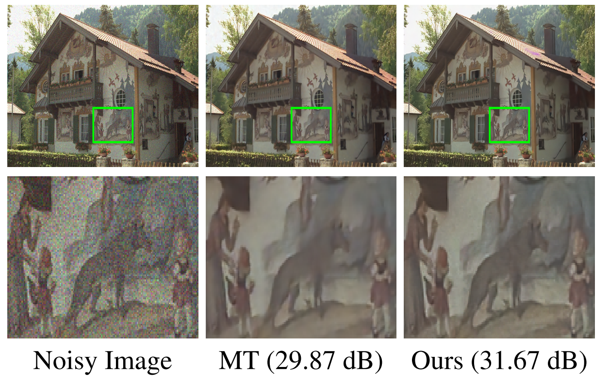
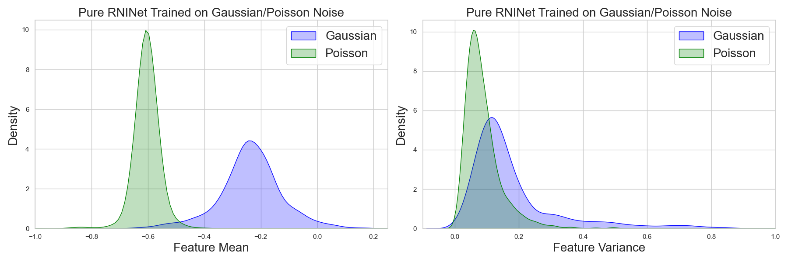

# Random Is All You Need: Random Noise Injection On Feature Statistics For Generalizable Deep Image Denoising

Official pytorch implementation of ["Random Is All You Need: Random Noise Injection On Feature Statistics For Generalizable Deep Image Denoising"](https://openreview.net/forum?id=z8PcUSKXXN) in International Conference on Learning Representations (ICLR) 2025.

## Introduction

Recent advancements in generalizable deep image denoising have catalyzed the development of robust noise-handling models. The current state-of-the-art, Masked Training (MT), constructs a masked SwinIR model which is trained exclusively on Gaussian noise (σ=15) but can achieve commendable denoising performance across various noise types (i.e. speckle noise, poisson noise). However, this method, while focusing on content reconstruction, often produces over-smoothed images and poses challenges in mask ratio optimization, complicating its integration with other methodologies. In response, this paper introduces RNINet, a novel architecture built on a streamlined encoder-decoder framework to enhance both efficiency and overall performance. Initially, we train a pure RNINet (only simple encoder-decoder) on individual noise types, observing that feature statistics such as mean and variance shift in response to different noise conditions. Leveraging these insights, we incorporate a noise injection block that injects random noise into feature statistics within our framework, significantly improving generalization across unseen noise types. Our framework not only simplifies the architectural complexity found in MT but also delivers superior performance. Comprehensive experimental evaluations demonstrate that our method outperforms MT in various unseen noise conditions in terms of denoising effectiveness and computational efficiency (lower MACs and GPU memory usage), achieving up to 10 times faster inference speeds and underscoring it’s capability for large scale deployments.

<p align="center">
  
  
</p>


## Requirements

Python: 3.9.7
PyTorch: 2.0.0
CUDA: 11.8

## Training

Following previous work, we train the model exclusively on Gaussian noise (σ=15) and evaluate it on various noise types and levels.

**Usage Instructions:**

To run the training:

1. Modify the parameters in the JSON configuration file, **or**

2. Directly use the provided JSON file:

```
python train.py --opt options/denoise_args.json
```

Training Datasets (SwinIR Datasets): 

* DIV2K
* Flickr2K
* BSD500
* WED

(*Combine these datasets for training.*)

## Testing

You need to download the checkpoint and put them in the model_zoo folder.

* Checkpoint for RNINet: https://drive.google.com/file/d/104gbqzoXQ1l6MWbN_ZYK7v1tdxKNU-jS/view
* Checkpoint for Masked Training: https://drive.google.com/file/d/1OybE6HqyOYQo_lYzn6HI9XKHf-R-dbbk/view

You can run the notebook file `test_model.ipynb` to obtain **Poisson denoising** results. (Replace `data_path` with your testset.)

For an image with **Speckle noise** and **Salt & Pepper noise**, please use the MATLAB code `generate_noise/add_noise.m` to generate them.

After generating images with speckle noise and salt & pepper noise, you can then create an image with **Mixture noise** by adding `Poisson noise`.

For **ISP noise**, you can refer to `load_data.py`, `process.py`, and `unprocess.py`.

For **Monte Carlo Rendered Image Noise**, you can refer to `reinhard_tonemap.py`.

More details can be found in our original paper.

Testsets:

* McMaster
* CBSD68
* Kodak24
* Urban100
  
## Citation
If you find our work or code is useful for your research, please kindly cite our paper.
```
@inproceedings{
yin2025random,
title={Random Is All You Need: Random Noise Injection on Feature Statistics for Generalizable Deep Image Denoising},
author={Zhengwei Yin and Hongjun Wang and Guixu Lin and Weihang Ran and Yinqiang Zheng},
booktitle={The Thirteenth International Conference on Learning Representations},
year={2025},
url={https://openreview.net/forum?id=z8PcUSKXXN}
}
```

